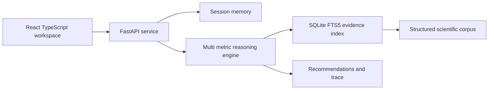

# TerraLens AI

TerraLens AI is an evidence-grounded biodiversity intelligence workspace. It asks for missing field context, retrieves traceable environmental evidence, reasons across interacting metrics, and returns measurable interventions with confidence, time horizon, caveats, and source provenance.

The default experience is fully local and requires no paid API key.

## What the reviewer can demonstrate

- Choose a semi-arid farm, fragmented estate, or polluted stream scenario.
- Edit soil, climate, biodiversity, land-use, and human-pressure metrics.
- Receive a clarification when fewer than three useful variables are available.
- Inspect recommendations that name the action, mechanism, affected metrics, expected change, time horizon, confidence, and contributing variables.
- Open the exact FAO, IPCC, IPBES, or USDA source behind every intervention.
- Inspect the four-stage reasoning trace and export the complete assessment as JSON.

## Architecture



The browser sends free text and an optional `LandscapeProfile`. The API merges new values into the conversation session. If the combined profile has fewer than three variables, the engine returns a targeted clarification. Otherwise, it evaluates compound stressors, selects guarded intervention rules, resolves their evidence records, and builds a structured assessment. Numeric benchmarks are emitted only when the corresponding evidence record supports them.

See [docs/ARCHITECTURE.md](docs/ARCHITECTURE.md) for the schema, retrieval details, confidence method, and design boundaries.

## Quick start

### Docker

```bash
docker compose up --build
```

Open `http://localhost:4173`. Interactive API documentation is available at `http://localhost:8000/docs`.

### Local development

Python 3.12 and Node.js 22 or newer are recommended.

```bash
python -m venv .venv
.venv/Scripts/python -m pip install -r backend/requirements-dev.txt
cd frontend
pnpm install
```

Run the API from the repository root:

```bash
.venv/Scripts/python -m uvicorn app.main:app --app-dir backend --reload
```

Run the client from `frontend`:

```bash
pnpm dev
```

No environment variables are required. `OPENAI_API_KEY` is reserved for a future optional language adapter; evidence retrieval and recommendations never depend on it.

## API example

```bash
curl -X POST http://localhost:8000/api/chat \
  -H "Content-Type: application/json" \
  -d '{"message":"How can I reverse biodiversity decline?","profile":{"land_use":"monoculture wheat","soil_organic_carbon":0.3,"annual_rainfall_mm":420,"habitat_diversity":2}}'
```

| Route | Purpose |
|---|---|
| `GET /api/health` | Readiness and indexed record count |
| `GET /api/scenarios` | Reviewer-ready sample landscapes |
| `POST /api/chat` | Clarification or grounded assessment |
| `GET /api/sessions/{id}` | Inspect merged profile and conversation memory |
| `DELETE /api/sessions/{id}` | Reset a conversation |

## Verification

```bash
cd backend
../.venv/Scripts/python -m pytest -q -p no:cacheprovider
../.venv/Scripts/ruff check app tests

cd ../frontend
pnpm test
pnpm run lint
pnpm run build
```

The integrated browser script in `tests/e2e.py` verifies the live backend and frontend at desktop and mobile widths, the sample assessment, recovery from an API failure, keyboard focus visibility, horizontal overflow, and serious or critical axe accessibility violations.

## CI and deployment

GitHub Actions runs backend tests and lint plus frontend unit tests, lint, and a production build. Both services have Dockerfiles, and `docker-compose.yml` provides a one-command reviewer environment. The frontend accepts `VITE_API_URL` at build time for deployment to any static host while the API can run on a standard container service.

## Evidence provenance

The seed corpus in `backend/data/evidence.json` contains structured records from FAO, IPCC, IPBES, USDA NRCS, and USDA Forest Service. Each record includes a stable ID, organization, title, year, URL, claim, metrics, interventions, and applicable conditions. Source URLs are exposed in every response instead of being hidden in a prompt.

## Known limits

- The evidence corpus is deliberately small and curated for a reviewer demo; it is not a global ecological knowledge base.
- Session memory is process-local and bounded to 200 recent sessions.
- Impact ranges are planning benchmarks, not predictions for a specific site.
- Species selection and planting calendars require local ecological validation.
- Production deployment should add durable storage, authentication, observability, and scheduled evidence review.

## Five-minute reviewer script

1. Open the semi-arid wheat farm.
2. Note that carbon, rainfall, land use, habitat, fragmentation, and pollution are evaluated together.
3. Run the grounded assessment.
4. Expand the reasoning trace and open an IPCC or FAO citation.
5. Start a new case with only land use; observe the targeted clarification instead of a generic answer.
