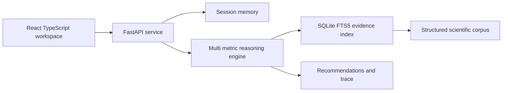
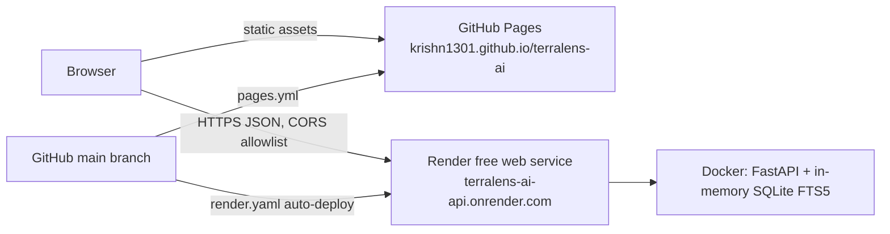

# TerraLens AI

TerraLens AI is an evidence-grounded biodiversity intelligence workspace. It asks for missing field context, retrieves traceable environmental evidence, reasons across interacting metrics, and returns measurable interventions with confidence, time horizon, caveats, and source provenance.

The default experience requires no paid API key and no credentials.

| | |
|---|---|
| Live demo | https://krishn1301.github.io/terralens-ai/ |
| Backend API | https://terralens-ai-api.onrender.com |
| API documentation | https://terralens-ai-api.onrender.com/docs |
| Repository | https://github.com/krishn1301/terralens-ai |

> The API runs on Render's free tier, which sleeps after about 15 minutes without traffic. The first request after a pause can take up to a minute while it wakes; the interface keeps your inputs and asks you to retry if that request times out. Opening the API health URL first warms it up.

## What the reviewer can demonstrate

- Choose a semi-arid farm, fragmented estate, or polluted stream scenario.
- Edit soil, climate, biodiversity, land-use, and human-pressure metrics.
- Receive a clarification when fewer than three useful variables are available.
- Inspect recommendations that name the action, mechanism, affected metrics, expected change, time horizon, confidence, and contributing variables.
- Open the exact FAO, IPCC, IPBES, or USDA source behind every intervention.
- Inspect the four-stage reasoning trace and export the complete assessment as JSON.

## Architecture



The browser sends free text and an optional `LandscapeProfile`. The API merges new values into the conversation session. If the combined profile has fewer than three variables, the engine returns a targeted clarification. Otherwise, it evaluates compound stressors, selects guarded intervention rules, resolves their evidence records, and builds a structured assessment. Numeric benchmarks are emitted only when the corresponding evidence record supports them.

See [docs/ARCHITECTURE.md](docs/ARCHITECTURE.md) for the schema, retrieval details, confidence method, and design boundaries.

## Technology stack

| Layer | Technology |
|---|---|
| Frontend | React 19, TypeScript, Vite, lucide-react icons |
| Backend | Python 3.12, FastAPI, Pydantic, Uvicorn |
| Retrieval | SQLite FTS5 (Porter stemming) over a curated JSON evidence corpus |
| Reasoning | Deterministic multi-metric rule engine with evidence-linked confidence |
| Testing | pytest, Ruff, Vitest, Testing Library, ESLint, Playwright with axe-core |
| Delivery | Docker, Docker Compose, GitHub Actions, GitHub Pages, Render |

## Quick start

### Docker

```bash
docker compose up --build
```

Open `http://localhost:4173`. Interactive API documentation is available at `http://localhost:8000/docs`.

### Local development

Python 3.12 and Node.js 22 or newer are recommended.

```bash
python -m venv .venv
.venv/Scripts/python -m pip install -r backend/requirements-dev.txt
cd frontend
pnpm install
```

Run the API from the repository root:

```bash
.venv/Scripts/python -m uvicorn app.main:app --app-dir backend --reload
```

Run the client from `frontend`:

```bash
pnpm dev
```

No environment variables are required for local use.

## Environment variables

See `.env.example`. All variables are optional and none are secrets.

| Variable | Read by | Purpose |
|---|---|---|
| `TERRALENS_CORS_ORIGINS` | Backend at startup | Comma-separated extra browser origins. Localhost development origins are always allowed; `*` and non-HTTP values are ignored. Production value: `https://krishn1301.github.io`. |
| `PORT` | Backend container | Port Uvicorn binds to. Render injects it; defaults to `8000`. |
| `VITE_API_URL` | Frontend build | Public backend URL. Defaults to `http://localhost:8000`. |
| `VITE_BASE_PATH` | Frontend build | Sub-path the site is served from. `/terralens-ai/` on GitHub Pages, `/` elsewhere. |
| `OPENAI_API_KEY` | Nothing yet | Reserved for a future optional language adapter. Retrieval and recommendations never depend on it. |

## API example

```bash
curl -X POST http://localhost:8000/api/chat \
  -H "Content-Type: application/json" \
  -d '{"message":"How can I reverse biodiversity decline?","profile":{"land_use":"monoculture wheat","soil_organic_carbon":0.3,"annual_rainfall_mm":420,"habitat_diversity":2}}'
```

| Route | Purpose |
|---|---|
| `GET /docs` | Interactive OpenAPI documentation |
| `GET /api/health` | Readiness and indexed record count |
| `GET /api/scenarios` | Reviewer-ready sample landscapes |
| `POST /api/chat` | Clarification or grounded assessment |
| `GET /api/sessions/{id}` | Inspect merged profile and conversation memory |
| `DELETE /api/sessions/{id}` | Reset a conversation |

## Verification

```bash
cd backend
../.venv/Scripts/python -m pytest -q -p no:cacheprovider
../.venv/Scripts/ruff check app tests

cd ../frontend
pnpm test
pnpm run lint
pnpm run build
```

The integrated browser script in `tests/e2e.py` needs Playwright's Chromium (`.venv/Scripts/python -m playwright install chromium`). It checks, at desktop (1440×900) and mobile (390×844) widths: the sample assessment, a clarification followed by a follow-up turn in the same session, evidence links, the reasoning trace and caveats, recovery from HTTP 503 and from an unreachable API, keyboard focus visibility, horizontal overflow, failed network requests, console errors, and serious or critical axe accessibility violations.

```bash
# Against local servers (API on :8000, pnpm dev on :5173)
.venv/Scripts/python tests/e2e.py

# Against the public deployment
TERRALENS_E2E_URL=https://krishn1301.github.io/terralens-ai/ .venv/Scripts/python tests/e2e.py
```

## Deployment



- **CI** (`.github/workflows/ci.yml`) runs backend tests and Ruff plus frontend tests, lint, and a production build on every push.
- **Frontend** (`.github/workflows/pages.yml`) builds on each push to `main` with `VITE_API_URL` taken from the repository variable of the same name and `VITE_BASE_PATH=/terralens-ai/`, then publishes to GitHub Pages. The workflow fails early if the variable is missing.
- **Backend** (`render.yaml`) is a Render Blueprint for a free Docker web service built from `backend/Dockerfile`. It runs as a non-root user, binds to Render's `PORT`, uses `/api/health` as its health check, sets `TERRALENS_CORS_ORIGINS`, and redeploys automatically on pushes to `main`.
- Unexpected server errors return a generic JSON message; stack traces and inputs are never included in responses.

To deploy your own copy: create the Render service from the Blueprint (`https://render.com/deploy?repo=<your repo URL>`), set the repository variable `VITE_API_URL` to its URL, enable Pages with source "GitHub Actions", and update `TERRALENS_CORS_ORIGINS` in `render.yaml` to your Pages origin.

## Evidence provenance

The seed corpus in `backend/data/evidence.json` contains structured records from FAO, IPCC, IPBES, USDA NRCS, and USDA Forest Service. Each record includes a stable ID, organization, title, year, URL, claim, metrics, interventions, and applicable conditions. Source URLs are exposed in every response instead of being hidden in a prompt.

## Known limits

- The evidence corpus is deliberately small and curated for a reviewer demo; it is not a global ecological knowledge base.
- Session memory is process-local and bounded to 200 recent sessions. On the hosted demo, sessions are also lost whenever the free instance sleeps or redeploys.
- The hosted API runs on a free tier with a cold start of up to about a minute after inactivity.
- Impact ranges are planning benchmarks, not predictions for a specific site.
- Species selection and planting calendars require local ecological validation.
- Production deployment should add durable storage, authentication, observability, and scheduled evidence review.

## Five-minute reviewer script

No login or API key is needed. Optionally open https://terralens-ai-api.onrender.com/api/health first to wake the API.

1. Open https://krishn1301.github.io/terralens-ai/ and choose the semi-arid wheat farm.
2. Note that carbon, rainfall, land use, habitat, fragmentation, and pollution are evaluated together.
3. Run the grounded assessment.
4. Expand the reasoning trace and open an IPCC or FAO citation.
5. Select **New case**, enter only a land use, and run it: the assistant asks for the specific missing variables instead of giving a generic answer.
6. Fill in the requested values and run again. The follow-up continues the same session and returns a full assessment.
7. Open https://terralens-ai-api.onrender.com/docs to try the API directly.
